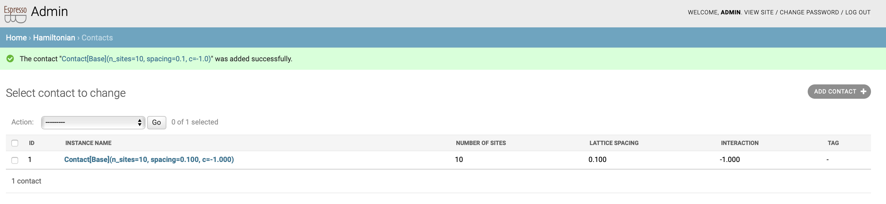

# Adding data

This section shows you how to populate your database.

There are basically two options:
1. you can use the admin page to adjust entries.
2. you can write your own script to add data.

## The admin page
To have access to the admin page, you should first create a super user.
This is done by
```
$ python manage.py createsuperuser
```
Once you have done that, you can see the admin area after [logging in: http://127.0.0.1:8000/login/](http://127.0.0.1:8000/login/).
E.g., your menu bar should have two more links: [Notifications: http://127.0.0.1:8000/notifications/](http://127.0.0.1:8000/notifications/) and [admin: http://127.0.0.1:8000/admin/](http://127.0.0.1:8000/admin/).

On the admin page, you see a summary of all your tables.
Particularly, on the [contact hamiltonian admin: http://127.0.0.1:8000/admin/hamiltonian/contact/](http://127.0.0.1:8000/admin/hamiltonian/contact/), you find an empty table.
To create an entry, click on [add entry](http://127.0.0.1:8000/admin/hamiltonian/contact/add/) and fill out the forms and save.
E.g., after choosing `n_sites=10`, `spacing=0.1` and `c=-1.0`, your table should look like this



## Data scripts
