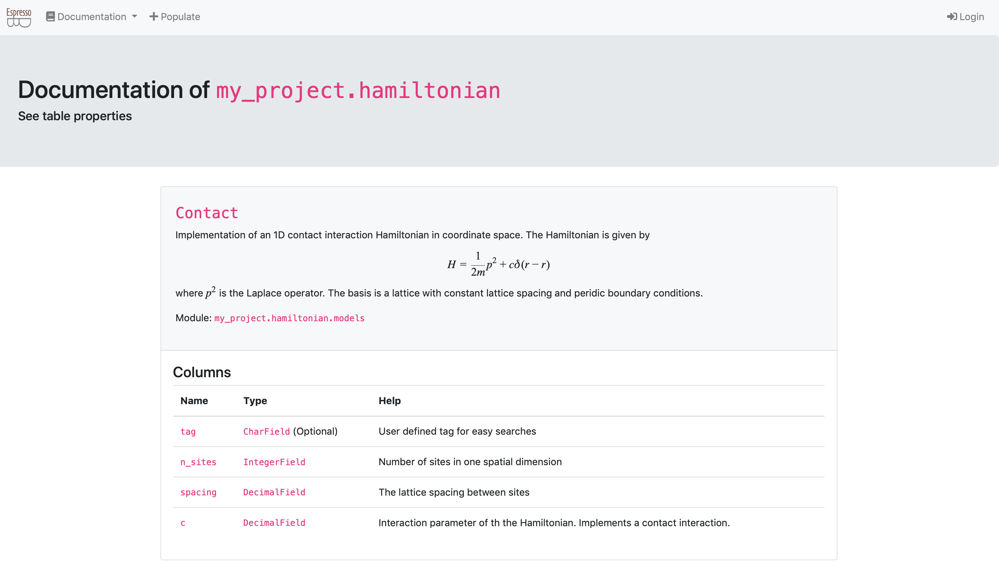

# Create the hamiltonians app

## Creating the infrastructure

For now your project is basically empty.
To implement new tables, you have to create apps -- which you can view as python sub modules of your project.

To do so, you have to run
```bash
$ python manage.py startapp hamiltonian
App `hamiltonian` was successfully created. In order to install it
1. Adjust the app (directory `/path/to/project/my_project/my_project/hamiltonian`)
2. Add `my_project.hamiltonian` to the `PROJECT_APPS` in `settings.yaml`
3. Run `python manage.py makemigrations`
4. Run `python manage.py  migrate`
```

This will create the folder structure for the `my_project.hamiltonian` submodule.
To let Django know that you want to include this app in your project, modify `settings.yaml` to
```
SECRET_KEY: "{sup3r-secr3t-p4ssw0rd}"
PROJECT_APPS:
    - my_project.hamiltonian
ALLOWED_HOSTS: []
DEBUG: True
```
Because you have not added new tables yet, there is nothing to migrate.
The web view however will now have a new tab [http://127.0.0.1:8000/documentation/hamiltonian/](http://127.0.0.1:8000/documentation/hamiltonian/) which will find the new app with no tables.


## Creating tables

Tables are implemented in the `models.py` file within each app.
To implement your first table adjust the `my_project/hamiltonian/models.py` to
```python
"""Models of hamiltonian
"""

# Note: if you want your models to use espressodb features, they must inherit from Base

from django.db import models
from espressodb.base.models import Base


class Contact(Base):
    r"""Implementation of an 1D contact interaction Hamiltonian in coordinate space.

    The Hamiltonian is given by
    $$
        H = \frac{1}{2 m} p^2 + c \delta(r - r)
    $$
    where \( p^2 \) is the Laplace operator.

    The basis is a lattice with constant lattice spacing and periodic boundary conditions.
    """

    n_sites = models.IntegerField(
        verbose_name="Number of sites",
        help_text="Number of sites in one spatial dimension",
    )
    spacing = models.DecimalField(
        verbose_name="lattice spacing",
        max_digits=5,
        decimal_places=3,
        help_text="The lattice spacing between sites",
    )
    c = models.DecimalField(
        verbose_name="Interaction",
        max_digits=5,
        decimal_places=3,
        help_text="Interaction parameter of th the Hamiltonian."
        " Implements a contact interaction.",
    )

    class Meta:
        unique_together = ["n_sites", "spacing", "c"]
```

The inheritance of EspressoDB's `Base` class
```python
class Contact(Base):
```
allows to utilize EspressoDB's features like the population view or auto documentation.
Each class will correspond to a table in your database.

Each class attribute which is associated with a `models.Field` will be a column of the table.
By default `Base` adds the following columns `user`, `tag`, `last_modified`.
The user is set whenever EspressoDB identifies a logged in user (e.g., from your database connection file), the `tag` field is a string you can use for searching the database.
This will become relevant for inheritance later on.
The `last_modified` field is updated to the current time whenever a table row is changed (or saved for that matter).

For this specific class, you add the following three columns `n_sites`,  `spacing`, and `c`.
We have used `DecimalField`s instead of `FloatFields` because this allows to use the equal expression to check numbers.
Particularly, the last two lines
```python
class Meta:
    unique_together = ["n_sites", "spacing", "c"]
```
tell the table that no matter what, it does not allow to insert an entry in the database if ther already is an entry with the same exact `n_sites`,  `spacing`, and `c`.
Furthermore, the doc string of the class and the the help text of the fields are used to generate the auto documentation.

To migrate the new tables in the database, you have to run
```bash
$ python manage.py makemigrations
Migrations for 'hamiltonian':
  my_project/hamiltonian/migrations/0001_initial.py
    - Create model Contact
```
which creates the migrations file `my_project/hamiltonian/migrations/0001_initial.py`.
This file summarizes the strategy how to update the database.

Next, to actually insert the empty table, you have to run
```bash
$ python manage.py migrate
Operations to perform:
  Apply all migrations: admin, auth, contenttypes, hamiltonian, notifications, sessions
Running migrations:
  Applying hamiltonian.0001_initial... OK
```
Now you have implemented the tables.

This change is reflected in your documentation view [documentation view](http://127.0.0.1:8000/documentation/hamiltonian/):


The webpage uses [katex](https://katex.org) to render the latex expressions.
You can use `$$` for equations and `\(` for inline math.
