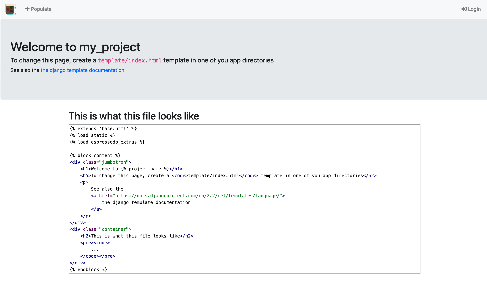

# Create your own project

The starting point is that you have [installed EspressoDB](../../Usage.md#install-espressodb).

## Start the project

Go to your directory of choice and type
```bash
$ espressodb startproject my_project
```
This will return
```
Setting up new project `my_project` in `/path/to/project`
-> Creating `db-config.yaml` in the project root dir `/path/to/project/my_project`
   Adjust this file to establish a connection to the database
-> Creating `settings.yaml`. Adjust this file to include later apps
-> Done!
-> You can now:
     1a. Migrate models by running `python manage.py migrate`
     1b. and launch a web app by running `python manage.py runserver`
     2. Add new models using `python manage.py startapp {APP_NAME}`
     3. Run `python -m pip install [--user] [-e] .` in the project root directory to add your package to your python path.
        See also `/path/to/project/my_project/setup.py`.
```
and create the folder structure of the project.

You can find two files in this directory:
1. `db-config.yaml` which describes how to connect to a database and
2. `settings.yaml` which describes how to encrypt passwords before entering in the DB, which apps are installed and how to run the web interface.

Both files are important in the sense that they possibly contain sensitive information.
The `SECRET_KEY` in `settings.yaml` and the database access in `db-config.yaml`.
You should think about with whom you want to share those files.
For now, the database will be a local SQLite file located at `/path/to/project/my_project/my_project-db.sqlite` which is generally not encrypted.
Let's create this database.

To verify that everything worked, enter the directory, apply migrations and start a local server
```bash
$ cd my_project
$ python manage.py makemigrations
No changes detected
$ python manage.py migrate
Operations to perform:
  Apply all migrations: admin, auth, contenttypes, notifications, sessions
Running migrations:
  Applying contenttypes.0001_initial... OK
  Applying auth.0001_initial... OK
  Applying admin.0001_initial... OK
  Applying admin.0002_logentry_remove_auto_add... OK
  Applying admin.0003_logentry_add_action_flag_choices... OK
  Applying contenttypes.0002_remove_content_type_name... OK
  Applying auth.0002_alter_permission_name_max_length... OK
  Applying auth.0003_alter_user_email_max_length... OK
  Applying auth.0004_alter_user_username_opts... OK
  Applying auth.0005_alter_user_last_login_null... OK
  Applying auth.0006_require_contenttypes_0002... OK
  Applying auth.0007_alter_validators_add_error_messages... OK
  Applying auth.0008_alter_user_username_max_length... OK
  Applying auth.0009_alter_user_last_name_max_length... OK
  Applying auth.0010_alter_group_name_max_length... OK
  Applying auth.0011_update_proxy_permissions... OK
  Applying notifications.0001_initial... OK
  Applying sessions.0001_initial... OK
```
The last command will create the database `my_project-db.sqlite` with EspressoDB's default tables.

After this you can run
```bash
$ python manage.py runserver
Watching for file changes with StatReloader
Performing system checks...

System check identified no issues (0 silenced).
October 07, 2019 - 17:28:59
Django version 2.2.2, using settings 'my_project.config.settings'
Starting development server at http://127.0.0.1:8000/
Quit the server with CONTROL-C.
```
And visit [http://127.0.0.1:8000/](http://127.0.0.1:8000/) to see the for now empty homepage


