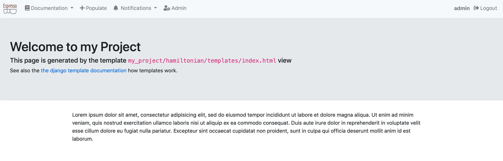
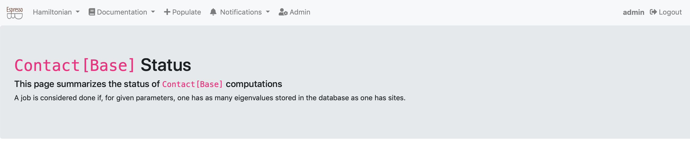
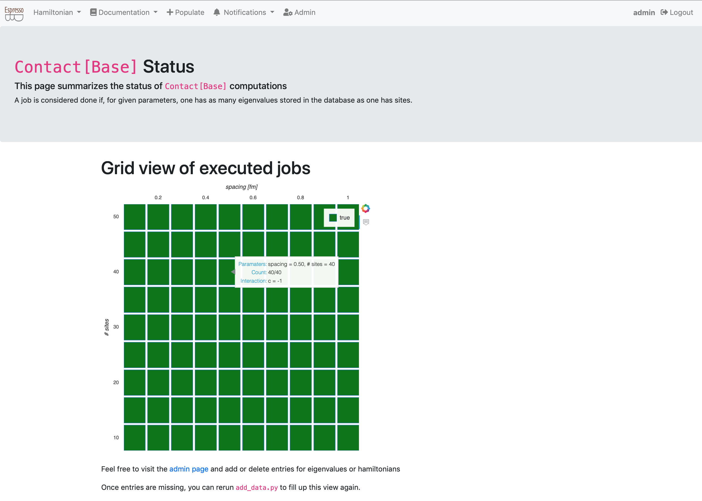

# Creating web views for summaries

Views are Python objects which provide information for html templates.
E.g., they query the database and return strings to be rendered in your browser.
When you enter an url in your browser, Django figures out which Python object to call which knows which template to render.

EspressoDB implements default views like the project homepage called which is rendered by the `index.html` template.

## Adjusting the index template
When looking for the index template, Django first checks your project template directories, e.g., `my_project/hamiltonian/templates/` and then enters EspressoDB's template dirs.
It renders the first template which matches the specification.
Thus, when you create `my_project/hamiltonian/templates/index.html`, you will overwrite the default index page.

Here is an example of how to overwrite the index page.
```



<div class="jumbotron">
    <h1>Welcome to my Project</h1>
    <h5>This page is generated by the template <code>my_project/hamiltonian/templates/index.html</code> view</h2>
    <p>
        See also the
        <a href="https://docs.djangoproject.com/en/dev/ref/templates/language/">
            the Django template documentation
        </a>
        how templates work.
    </p>
</div>
<div class="container">
    <p></p>
</div>

```
This will adjust the index page to


Content with `` or `{{ ... }}` will be parsed by the view.
E.g., `` denote template tags which can be loops, if statements and more.
The `{{ ... }}` templates will render variables.

Most importantly, for this template are the texts ``, which tells that it should use the `base.html` template and extend it.
Thus the link navbar and further html content will be present without you having to write anything.
The `` and `` denotes that within the `base.html` template, the content between the same exact blocks will be replaced with what you want to render.

See also [the Django docs for more information on templates](https://docs.djangoproject.com/en/dev/ref/templates/language/).

Last but not least, EspressoDB comes with a few default css and javascript packages like [KaTeX](https://katex.org) to render equations and [Bootstrap 4](https://getbootstrap.com/docs/4.0/getting-started/introduction/) for having nice looking responsive webpages with minimal effort.

## Views with plots

A nice feature of the Python backend is that you can directly export your plots to a homepage.
Whenever new data is added, your plot is dynamically updated.
So a possible plot page for this project would be a status view which summaries for which Hamiltonian all of the eigenvalues have been computed and which computations need to be repeated.

It is possible to just use matplotlib, store images dynamically and display them in your view.
In this example we have decided to use [Bokeh](https://bokeh.pydata.org/en/latest/) as it allows to have dynamic plots, which allow to, e.g., to zoom, or use mouse over effects on the web view (without storing images in an intermediate step).

To prepare the usage, you should install
```bash
pip install bokeh
```
It is good practice to place all dependencies in the project `requirements.txt` file as well.


### Creating a template view
We first start with setting up the view

Within the `my_project/hamiltonian/views.py` add the following lines
```python
from django.views.generic.base import TemplateView

from my_project.hamiltonian.models import Contact as ContactHamiltonian

class HamiltonianStatusView(TemplateView):
    template_name = "status.html"
    model = ContactHamiltonian

    def get_context_data(self, **kwargs):
        context = super().get_context_data(**kwargs)

        context["model"] = self.model

        return context
```

* The `TemplateView` class is a class with streamlines generating views.
* The `template_name = "status.html"` tells Django to look for a file called `status.html` to render this view
* The `get_context_data` method provides additional information to the rendering. E.g., that the model we are using is a `ContactHamiltonian`.
    We overload the default method to guarantee that we do not eliminate other needed information.

### Creating the template
Next we actually have to create the to be rendered template.
To do so, create the file `my_project/hamiltonian/templates/status.html` and add the following code
```html



<div class="jumbotron">
    <h1><code>{{model}}</code> Status</h1>
    <h5>This page summarizes the status of <code>{{model}}</code> computations</h2>
    <p>
        A job is considered done if, for given parameters, one has as many eigenvalues stored in the database as one has sites.
    </p>
</div>

```
The `{{model}}` now make use of the `context` parameter we have added (and will be rendered by the `str(ContactHamiltonian)` Python method).

### Update the urls
To view this page online, we have to let Django know where to find it.
This is done by adjusting `my_project/hamiltonian/urls.py` to include the following lines
```python
from django.urls import path

from my_project.hamiltonian.views import HamiltonianStatusView

app_name = "hamiltonian"
urlpatterns = [path("status/", HamiltonianStatusView.as_view(), name="status")]
```
E.g., when you visit [http://127.0.0.1:8000/hamiltonian/status/](http://127.0.0.1:8000/hamiltonian/status/), the `HamiltonianStatusView.as_view()` method is called, which renders the template.

By default, EspressoDB scans all your app directories and adds links to the navbar.
Thus, you should now be able to obtain the following web view



### Preparing data

Next we want to prepare data for the status view
```python
...

from my_project.hamiltonian.models import Eigenvalue

class HamiltonianStatusView(TemplateView):

    ...

    def prepare_data(self) -> "DataFrame":
        hamiltonians = self.model.objects.all()

        eigenvalues = Eigenvalue.objects.filter(hamiltonian__in=hamiltonians)

        level_count = (
            eigenvalues.to_dataframe(fieldnames=["hamiltonian__id", "n_level"])
            .rename(columns={"hamiltonian__id": "id"})
            .groupby(["id"])
            .count()
        )

        df = (
            hamiltonians.to_dataframe(fieldnames=["id", "spacing", "n_sites", "c"])
            .set_index("id")
            .join(level_count, on="id")
        )

        df["done"] = df["n_sites"] == df["n_level"]

        df["color"] = "green"
        df["color"] = df.color.where(df.done, "red")

        return df
```
By default EspressoDB queries can be [converted to Pandas `DataFrame`s using `django-pandas`](https://github.com/chrisdev/django-pandas) this simplifies the logic of this code:
1. We get all Hamiltonians for the specified `self.model`
2. We find all eigenvalues associated with the Hamiltonians
3. For each hamiltonian (id), we count the number of associated entries
4. We join the count information with the Hamiltonian information
5. We define that a job is done if the numbers of sites is the same as the numbers of eigenvalues
6. We add a color column corresponding to the "done" status

### Preparing the plot
Next we create a Bokeh grid plot within the status view class which will take the prepared DataFrame as input
```python
...

from bokeh.plotting import figure

class HamiltonianStatusView(TemplateView):

    ...

    @staticmethod
    def prepare_figure(data: "DataFrame") -> "Figure":
        fig = figure(
            x_axis_location="above",
            tools="hover",
            tooltips=[
                ("Paramaters", "spacing = @spacing{(0.3f)}, # sites = @n_sites"),
                ("Count", "@n_level/@n_sites "),
                ("Interaction", "c = @c "),
            ],
            width=600,
            height=600,
        )

        fig.rect(
            "spacing",
            "n_sites",
            width=0.09,
            height=4.6,
            source=data,
            fill_color="color",
            legend="done",
        )

        fig.xaxis.axis_label = "spacing [fm]"
        fig.xaxis.axis_label_standoff = 10
        fig.yaxis.axis_label = "# sites"
        fig.yaxis.axis_label_standoff = 10

        fig.outline_line_color = None
        fig.grid.grid_line_color = None
        fig.axis.axis_line_color = None
        fig.axis.major_tick_line_color = None
        fig.axis.minor_tick_line_color = None

        fig.x_range.range_padding = 0.0
        fig.y_range.range_padding = 0.0

        return fig
```

### Wrapping things together
To let the template know that we have created a plot, we need to pass the infromation to the context.
Thus we have to update the previously written `get_context_data` method
```python
...

from bokeh.embed import components
from bokeh import __version__ as bokeh_version

class HamiltonianStatusView(TemplateView):

    model = ContactHamiltonian
    template_name = "status.html"

    def get_context_data(self, **kwargs):
        context = super().get_context_data(**kwargs)

        df = self.prepare_data()
        fig = self.prepare_figure(df)
        script, div = components(fig)

        context["script"] = script
        context["div"] = div
        context["model"] = self.model
        context["bokeh_version"] = bokeh_version

        return context
```
The `bokeh.embed.components` transforms our figure into html and javascript objects which the webpage can render.
Furthermore, we need the `bokeh_version` to ensure that your Python `bokeh` installation matches the Bokeh javascript version.

Finally, we need to let the template know how to render the plot.
The new `status.html` should look like this
```html



<link href="https://cdn.pydata.org/bokeh/release/bokeh-{{bokeh_version}}.min.css" rel="stylesheet" type="text/css">
<link href="https://cdn.pydata.org/bokeh/release/bokeh-widgets-{{bokeh_version}}.min.css" rel="stylesheet" type="text/css">
<script defer src="https://cdn.pydata.org/bokeh/release/bokeh-{{bokeh_version}}.min.js"></script>
<script defer src="https://cdn.pydata.org/bokeh/release/bokeh-widgets-{{bokeh_version}}.min.js"></script>
<script defer src="https://cdn.pydata.org/bokeh/release/bokeh-tables-{{bokeh_version}}.min.js"></script>



<div class="jumbotron">
    <h1><code>{{model}}</code> Status</h1>
    <h5>This page summarizes the status of <code>{{model}}</code> computations</h2>
    <p>
        A job is considered done if, for given parameters, one has as many eigenvalues stored in the database as one has sites.
    </p>
</div>
<div class="container">
    <h1>Grid view of executed jobs</h1>
    {{div|safe}}
</div>
<div class="container my-4">
    <p>Feel free to visit the <a href="">admin page</a> and add or delete entries for eigenvalues or hamiltonians</p>
    <p>Once entries are missing, you can rerun <code>add_data.py</code> to fill up this view again.</p>
</div>
{{script|safe}}

```
In the ``, we have loaded the CSS and javascript file version of Bokeh.
We have decided to not included it ourselves (meaning on you machine), as this allows you to install any Bokeh version you like.
But therefore they will be downloaded once you view this page.

Furthermore, we have added the additional `|sage` template filter for `{{div|safe}}` and `{{script|safe}}`.
This means that Django should trust this source and actually execute html / javascript statements.
Without that, the template variables would not be rendered and presented as raw code.

If you now visit the status page, you should either see a completely red or completely green status report, depending on if you have run the updated eigenvalues script


You can now play around and delete some hamiltonians or eigenvalues, e.g., from the admin page and rerun the computation script.

### Summary
The final source code for this example can also be found in the [EspressoDB repository](https://github.com/callat-qcd/espressodb/tree/master/example/my_project).
