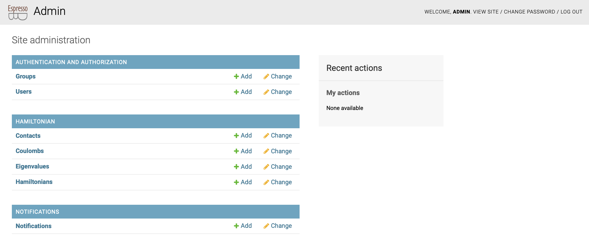

# The private views

By default, views you create are public -- any user who has access to the address where the web page is launched, is able to see the content.
It is also possible to require the user to be logged in (and have specified permissions) to see views.

Since you have just created the database, there is no user specified.
You can create a new user by running
```
python manage.py createsuperuser
```
This information is stored (encrypted) in the database `my_project.sqlite`.

Once you have logged in, you will be able to access two more pages:


1. The notifications page: [http://127.0.0.1:8000/notifications/](http://127.0.0.1:8000/notifications/)
2. And the admin pages: [http://127.0.0.1:8000/admin/](http://127.0.0.1:8000/admin/)

Both pages are present by default once you create your project with EspressoDB.

### The notifications page


The notifications page works similarly to Python's `logging` module.
You can create a notifier instance and directly log messages to the database
```python
from espressodb.notifications import get_notifier

NOTIFIER = get_notifier()

NOTIFIER.info("Hello world!")
```
which can be viewed on the notifications page.
Different to logging you can also specify groups which are allowed to see this message -- a user not present in this group will not be able to see them.

### The admin pages



As the name suggests, the admin pages have full management control over all other pages (unless you restrict your database access).
You can search, add, change and delete existing entries from this page.
By default, all models specified in your `PROJECT_APPS` will be listed here.


