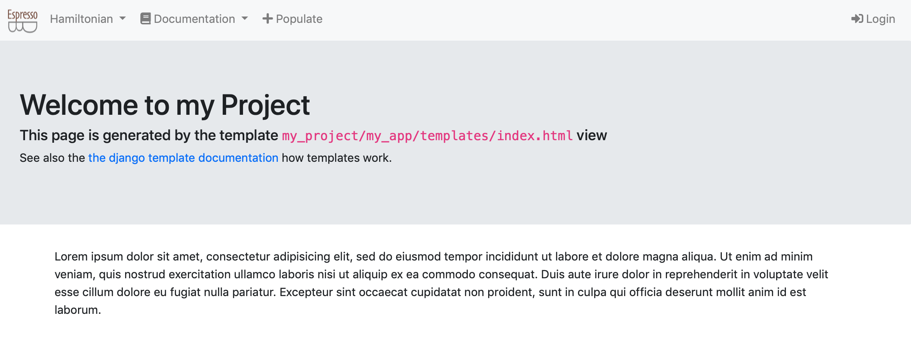
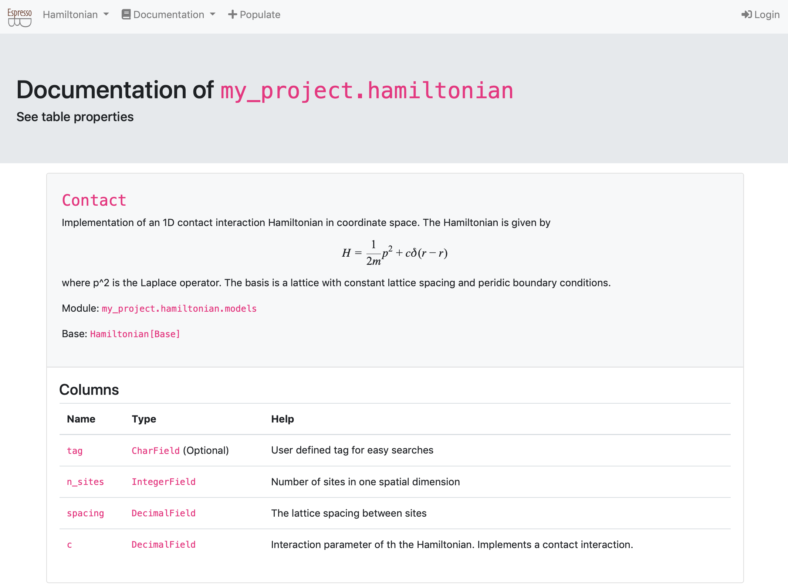
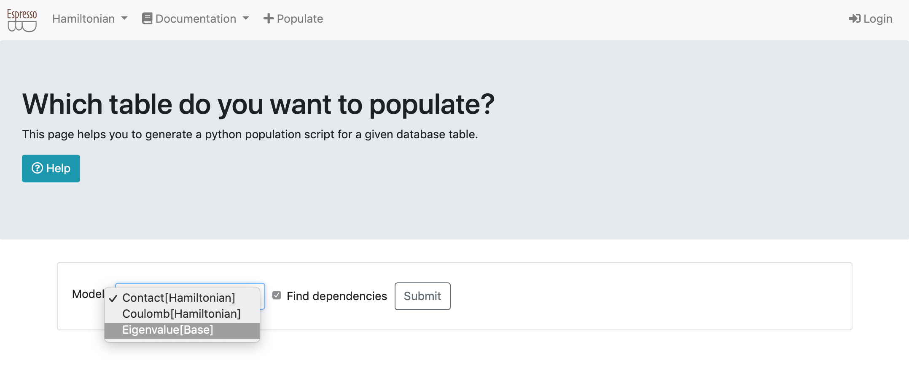
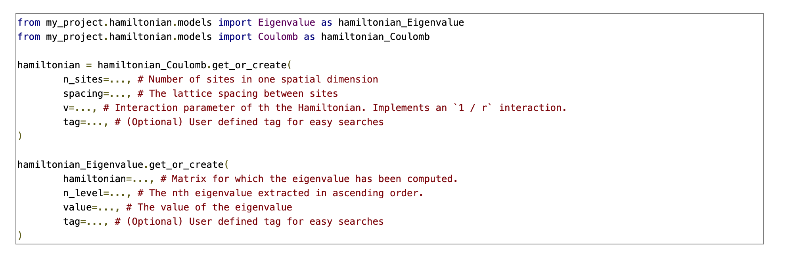
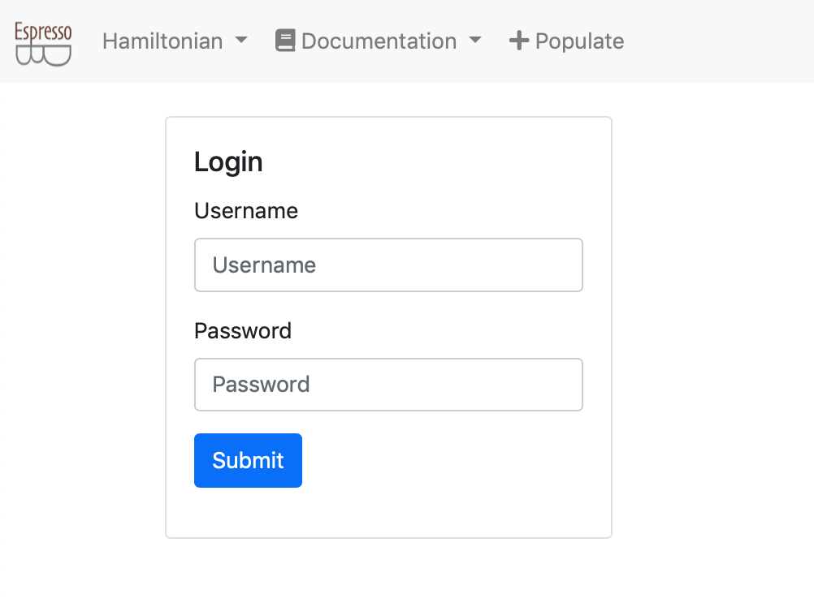
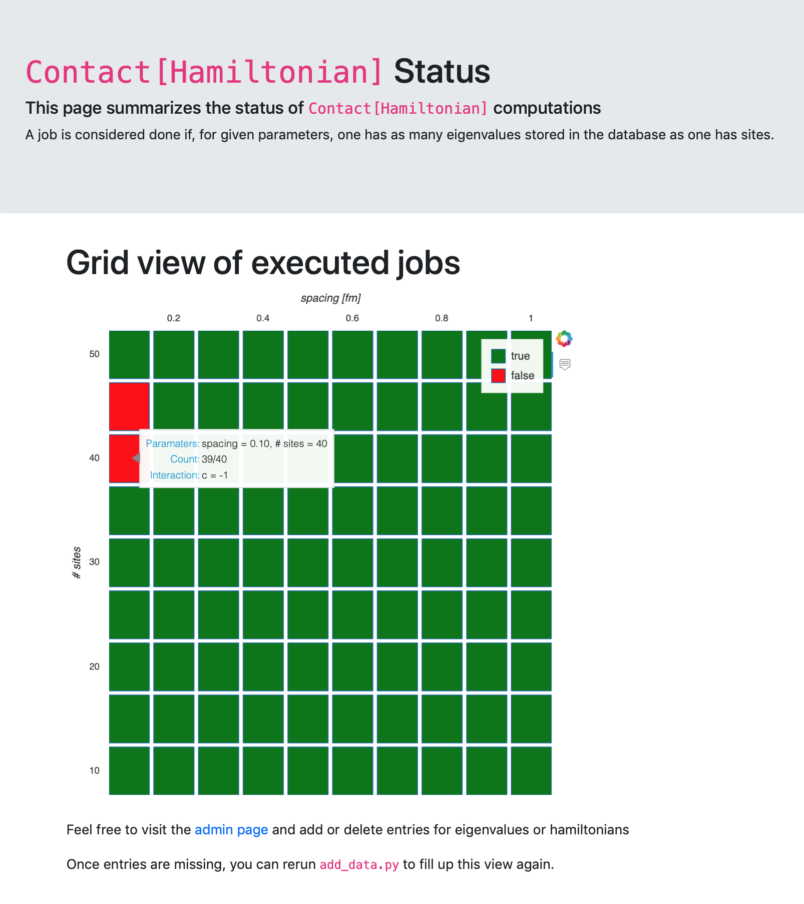

## The public views

After launching a local server
```
python manage.py runserver
```
you should be able to have access to five pages:

1. the project homepage: [http://127.0.0.1:8000/](http://127.0.0.1:8000/)
2. the project apps documentation: [http://127.0.0.1:8000/documentation/hamiltonian/](http://127.0.0.1:8000/documentation/hamiltonian/)
3. the population views: [http://127.0.0.1:8000/populate/](http://127.0.0.1:8000/populate/)
4. the login page: [http://127.0.0.1:8000/login/](http://127.0.0.1:8000/login/)
5. the Hamiltonian status page: [http://127.0.0.1:8000/hamiltonian/status/](http://127.0.0.1:8000/hamiltonian/status/)

All but the Hamiltonian status page are default views of EspressoDB.
Once you start your project, you will have [a homepage](#the-home-page), [the population views](#the-population-views), and [the admin pages](#the-admin-pages).
Whenever you create a new app, EspressoDB directly scans your app and adds documentations to [the doc page](#the-doc-page).

The only view which is specifically implemented for the project is [the Hamiltonian status page](#the-hamiltonian-status-page).

All of the pages are completely customizable.

On the bottom of the page, the current version of EspressoDB and the repo is displayed.

### The home page



The homepage is just a plain page which should summarize infos.
For this project, there are no specific informations here.

### The doc page



For all of the models present in the project apps, this view automatically generates a documentation page.
E.g., the above picture is generated from the
```python
class Contact(Hamiltonian)
```
class in `my_project/hamiltonian/models.py`.

For each app, each model / table has an entry on this page which describe the columns of the table.
E.g., the pages lists the name of the columns, the type and whether they are optional or have default values and the help text.

### The population views

The population views are dynamic forms which provide scripts to populate (existing) tables.
These views query the user which table they intend to populate and find nested dependencies (e.g. the `Eigenvalue` table needs to know which `Hamiltonian` they come from).



Once all dependencies are identified, they return a Python script which can be run after it's arguments are entered.




### The login page



The login page logs you in as a registered user.
See also [the private views](private-views) for what to expect there.


### The Hamiltonian status page



The status page displays informations about one of the tables called `Contact[Hamiltonian]`.
It displays a dynamically generated grid plot which visualizes the status of computations.
A green field corresponds to completed jobs, a red field to not finished jobs.
A mouse-over effect displays further information.
Once the database is updated (and the web page reloaded) the plot will also update.

This view is the only view which comes not as a default when initializing a project with EspressoDB.
