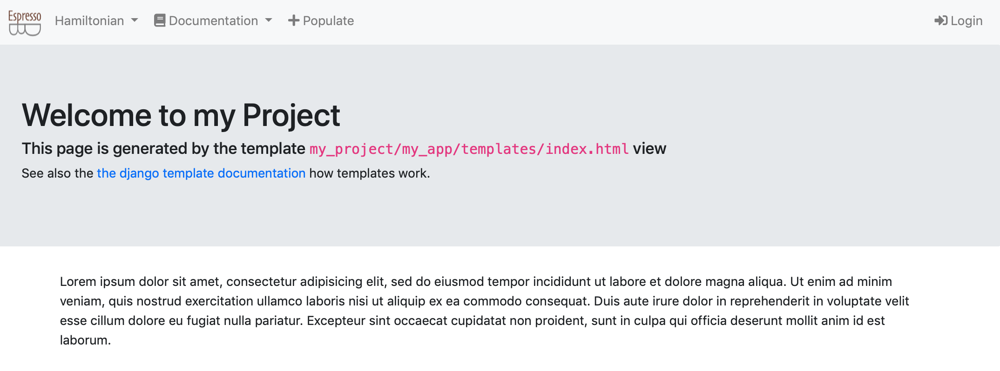

## The views
By default, you should be able to have access to five pages:

1. the project homepage: [http://127.0.0.1:8000/](http://127.0.0.1:8000/)
2. the project apps documentation: [http://127.0.0.1:8000/documentation/hamiltonian/](http://127.0.0.1:8000/documentation/hamiltonian/)
3. the population views: [http://127.0.0.1:8000/populate/](http://127.0.0.1:8000/populate/)
4. the login page: [http://127.0.0.1:8000/login/](http://127.0.0.1:8000/login/)
5. the Hamiltonian status page: [http://127.0.0.1:8000/hamiltonian/status/](http://127.0.0.1:8000/hamiltonian/status/)

All but the Hamiltonian status page are default views of EspressoDB.
Once you start your project, you will have [a homepage](#the-home-page), [the population views](#the-population-views), and [the admin pages](#the-admin-pages).
Whenever you create a new app, EspressoDB directly scans your app and adds documentations to [the doc page](#the-doc-page).

The only view which is specifically implemented for the project is [the Hamiltonian status page](#the-hamiltonian-status-page).

All of the pages are completely customizable.
We explain [how to update pages](../../devel/index) in the developers section for that.

On the bottom of the page, the current version of EspressoDB and the repo is displayed.

### The home page

The homepage is just a plain page which should summarize infos.
For this project, there are no specific informations here.

### The home page

The homepage is just a plain page which should summarize infos.
For this project, there are no specific informations here.

### The home page

The homepage is just a plain page which should summarize infos.
For this project, there are no specific informations here.

### The Hamiltonian status page

The status page displays informations about one of the tables called `Contact[Hamiltonian]` -- which is a toy example for a scientific object.
This particular Hamiltonian has three
