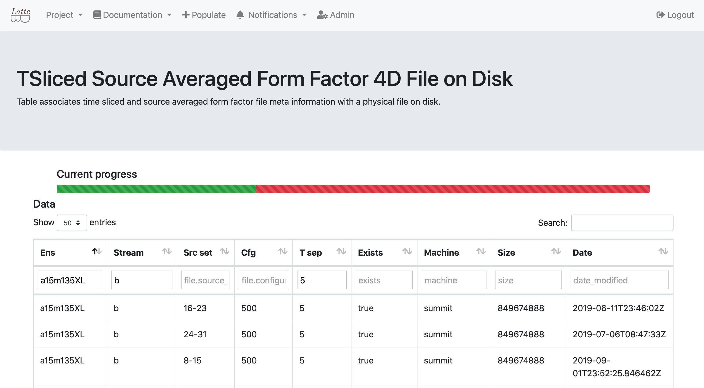

# Summary

Leadership computing facilities around the world support cutting-edge scientific research across a broad spectrum of disciplines including understanding climate change [@Kurth_2018], combating opioid addiction [@Joubert:2018:AOE:3291656.3291732], or simulating the decay of a neutron [@Berkowitz:2018gqe].
While the increase in computational power has allowed scientists to better evaluate the
underlying model, the size of these computational projects have grown to a point where
a framework is desired to facilitate managing the workflow.
A typical scientific computing workflow includes:

1. Defining all input parameters for every step of the computation;
2. Defining dependencies of computational tasks;
3. Storing some of the output data to tape;
4. Post-processing these data files;
5. Performing data analysis on output.

[``EspressoDB``](https://github.com/callat-qcd/espressodb/) is a programmatic object-relational data management framework implemented in Python and based on the [``Django`` web framework](https://www.djangoproject.com).
``EspressoDB`` was developed to streamline data management workflows, centralize and guarantee data integrity, while providing domain flexibility and ease of use.
The [*Features* section](#features) summarizes ``EspressoDB``.

[``LatteDB``](https://github.com/callat-qcd/lattedb/), an application of ``EspressoDB`` that is specialized to contain table definitions for Lattice QCD calculations, is currently being used to manage the workflow of the 2019 INCITE project titled *The Proton's Structure and the Search for New Physics* [@incite:2019]
and it will be used for the 2020 INCITE project titled *The Structure and Interactions of Nucleons from the Standard Model* [@incite:2020].
The corresponding website generated by ``LatteDB`` can be found at [https://ithems.lbl.gov/lattedb/](https://ithems.lbl.gov/lattedb/).
A precursor to ``EspressoDB`` and ``LatteDB`` was used to support a series of Lattice QCD projects
[@Nicholson:2018mwc; @Chang:2018uxx].
The framework provided by ``EspressoDB`` aims to support the ever increasing complexity of workflows of scientific computing at leadership computing facilities, with the goal of reducing the amount of human time required simply to manage the jobs, thus giving scientists more time to focus on science.
The [*Use case* section](#use-case) presents how ``LatteDB`` is integrated in the INCITE project.

# Features

``EspressoDB`` utilizes Python's ``Django`` Object-Relational Mapping (ORM) framework.
Tables correspond to Python classes, instances correspond to rows within this table and columns of such tables correspond to attributes of the instances.
Thus it is possible to filter for objects by their attributes or generate summary tables (``pandas.DataFrame``) within one line of code.
Furthermore, using an ORM allows to have the same interface independent of the backend.
It is possible to store data in a file based `SQLite` solution, or use more scalable options like `MySQL` or `Postgresql`.

``Django`` is part of many open-source projects and thus comes with extensive documentation.
Additionally, ``Django`` is scalable, comes with reliable tests and vast community support which manifests in the fact that it is commonly  used in large scale projects (BitBucket, Instagram, Mozilla, NASA and many more).
One guiding principle of ``EspressoDB`` is to not "re-invent the wheel" but instead leverage the support coming from ``Django``.
As a result, one can easily incorporate many of ``Django``'s extensions and find solutions to technical questions online.

Data integrity is important to scientific projects and becomes more challenging the larger the project.
In general, a SQL framework type-checks data before writing to the database and controls dependencies and relations between different tables to ensure internal consistency.
 ``EspressoDB`` implements an abstract ``Base`` class which allows additional user-defined constraints not supported by SQL (*e.g.* unique constraints using information spread across related tables).
Once the user has specified a set of conditions entries have to fulfill for each table, ``EspressoDB`` runs these cross checks for new data before storing it.

Another aspect of ``EspressoDB`` is to support collaborative and open-data oriented projects.
For this, ``Django``'s web hosting component is utilized and extended.
In addition to providing a centralized data platform, it is possible to spawn[^1] customized web pages which can be viewed, on a local machine only, a local network or the world wide web.
``EspressoDB`` simplifies creating projects by providing default ``Django`` configurations that set up, _e.g._, connections to the database and webpages to view associated tables.
With the default setting, ``EspressoDB`` spawns:

* Documentation views of implemented tables;
* A project wide notification system;
* Project specific Python interface guidelines which help writing scripts to populate the database;
* Admin pages for interacting with data in a GUI.

Further views can be implemented to interact with data and utilize existing Python libraries for summarizing and visualizing information.
This allows users to create visual progress updates on the fly and to integrate the database information to the data-processing workflow, significantly reducing the human overhead required due to improved automation.

More details, usage instructions and examples are documented at [espressodb.readthedocs.io](https://espressodb.readthedocs.io).

[^1]: Depending on the configuration, it is possible to provide selected access for multiple users on different levels.

# Use case

For an explicit use case, we describe the use of ``LatteDB`` by the CalLat Collaboration ([https://a51.lbl.gov/~callat/webhome/](https://a51.lbl.gov/~callat/webhome/)) in their computations on Summit at the Oak Ridge Leadership Computing Facility ([OLCF](https://www.olcf.ornl.gov)) through DOE INCITE Allocations [@incite:2019; @incite:2020].  Lattice QCD is one of the main applications awarded time at leadership computing facilities each year through the competitive DOE [INCITE](https://www.doeleadershipcomputing.org) and [ALCC](https://science.osti.gov/ascr/Facilities/Accessing-ASCR-Facilities/ALCC) Allocations, and therefore represents a major use case.

Lattice QCD (LQCD) is an inherently a stochastic method of simulating Quantum Chromodynamics (QCD) the fundamental theory of nuclear strong interactions, which is responsible for confining quarks into protons and neutrons and ultimately, for binding these nucleons into the atomic nuclei we observe in nature.
The application of LQCD to forefront research applications in nuclear physics is necessary to build a quantitative connection between our understanding of nuclei and QCD.  This is important as nuclei serve as laboratories and/or detectors for many experiments aiming to test the limits of the Standard Model of particle physics in our quest to understand questions such as: Why is the universe composed of matter and not anti-matter?  Does dark matter interact with regular matter other than gravitationally?  What is the nature of the neutrino and is it related to the observed excess of matter over anti-matter?  See Ref. [@Drischler:2019xuo] for a recent review of the interface of LQCD with our understanding of nuclear physics.

The application of LQCD to nuclear physics is an exascale challenge.  One of the main reasons these calculations are so expensive is that when LQCD is applied to systems of one or more nucleons, an exponentially bad signal-to-noise problem must be overcome.  While the optimal strategy for overcoming this challenge is not yet known, one thing common to all methods is the need for an exponentially large amount of statistics.
As such, these LQCD computations require the completion of hundreds of thousands to millions of independent sub-calculations (or tasks), with chained dependencies, in order to complete a single calculation.  These chained tasks write large amounts of temporary files to the scratch file system which are used as input for subsequent files, often with multiple input files required for the later computations.
Several such calculations (each with the hundreds-of-thousands to millions of independent tasks) must be performed in order to extrapolate the results to the physical point, defined as the limit of zero discretization (the continuum limit), the infinite volume limit and the limit of physical quark masses which are _a priori_ unknown and so must be determined through this extrapolation/interpolation procedure.
These requirements lead to a very complex set of computations that must be carried out with great care and a significant amount of human time and effort to ensure the computing cycles are used as efficiently as possible.

Compounding these challenges, the new computer Summit, is _disruptively fast_ compared to previous generations of leadership class computers.  Full machine-to-machine, Summit is approximately 15 times faster than Titan when applied to LQCD applications such as carried out by CalLat [@Berkowitz:2018gqe].  While this is great for scientific throughput, it also means the management of the computational jobs has become unwieldy with the management models typically used for such computations: Summit churns through the computations so fast, and produces so much data, it is not possible to keep up with the data processing and management with our older management tools.  At a high level, there are two challenges which are both critical to address for near-exascale computers such as Summit, which will become more important in the exascale era:

1. _Efficient bundling and management of millions on independent tasks with various resource requirements on heterogenous nodes_:
For good reason, the LCF do not allow the submission of millions of small tasks to the supercomputers (clogged queues, overtaxed service nodes etc.).  It is therefore imperative to have a light-weight, user-friendly task manager capable of efficiently bundling these millions of small tasks into large jobs while carefully distributing the work to various components of the heterogenous nodes to take full advantage of the computing capability of current and future machines.  This also enables a throughput of work such that the full calculations can be completed in a typical allocation period;

2. _Dependent task generation and data processing_:
The nested dependencies of all the tasks, and the subsequent data processing and collection must happen in near real time.  In the case of the CalLat production, multiple peta-bytes of temporary files are written to the scratch file system and these must be used for subsequent computations and processed sufficiently quickly that they are not purged by the auto-purge mechanisms put in place by the supercomputing centers.  Ultimately, these multi-petabytes of data are processed down to hundreds of tera-bytes of valuable data worth saving spread over hundreds of thousands of files.  It is essential to have a light-weight, user-friendly, and real time tracking of what tasks have been completed, what files are missing etc., so that users can nimbly fill in missing dependent tasks to complete and process the data without having to keep the full working tree in human memory.

Members of CalLat are addressing issue 1 through the creation of job management software, [METAQ](https://github.com/evanberkowitz/metaq) [@Berkowitz:2017vcp] and MPI_JM [@Berkowitz:2018gqe; @Berkowitz:2017xna].  ``EspressoDB`` is designed to address the second issue.  A feature that will be added to ``LatteDB`` very soon is integration with MPI_JM.

As a concrete example, we consider the nucleon elastic formfactor project being carried out by CalLat [@incite:2019; @incite:2020].  For each _ensemble_ of configurations used (one choice of input parameters) the computation requires the following dependent steps:

1. For each configuration (of O(1000)) in an ensemble (of O(20)), make several quark sources (grouped in batches of 8);
2. For each source, create a quark propagator;
3. For each quark propagator:
    1. Create a proton correlation function to determine the proton mass;
    2. Create O(10) proton _sequential_ sinks at different separation times (times 4 for different spin and flavor combinations);
4. For each time-separation, group the 8 _sequential_ sinks from the 8 propagators into a single _coherent sequential_ sink [@Bratt:2010jn];
5. For each time-separation, Solve a _sequential_ propagator from the _coherent sequential_ sink;
6. For each time-separation, tie each of the original 8 propagators with the sequential propagator to construct a 4-dimensional (4D) _formfactor_ correlation function;
7. Process the data to prepare it for analysis and the extraction of physics.
8. Repeat for multiple source sets (of 8) if more statistics are required.

Each of the steps above leads to the generation of many large (multi-gigabyte) data files, most of which are not saved.  ``LatteDB`` is used to track the status of these data files to know if they need to be created or if the next step can proceed.  The final data production step, 6, leads to our final data file that need further processing prior to our final analysis and saving of the files.
``LatteDB`` is also tremendously useful for managing the data processing steps which proceed as:

1. For each configuration, for each time separation, for each of the 8 sources, _time slice_ the 4D data formfactor files to only the time slices containing relevant data;
2. For each configuration, for each time separation, for each source set, average the 8 formfactor_tsliced files to a source averaged file.
3. When all configurations are complete, concatenate these files together.
4. As needed, Fourier Transform these files to project the formfactors onto definite momentum transfers.
5. Analyze the correlation functions to extract the relevant physics.

In Figure 1, we show an example ``LatteDB`` Table from step 2.  The user is able to filter on each column to very quickly assess the production status (green means the tsliced_source_averaged file exists, red means it is missing) and decide what configurations in what ensembles need to be managed in production.

More importantly, our production scripts interact with ``LatteDB`` and so, even without this visualization, the scripts will only try and generate work that in this case, ``LatteDB`` believes is missing.  This interaction with ``LatteDB`` significantly reduces the amount of human time required to manage the computations.  We are actively constructing routines to also store the final data files to tape, the status of which is stored in a related ``LatteDB`` table.  Thus, the user can query the database instead of the file system for the existence of data files, significantly reducing the load on the file system as well.  Example use scripts for interacting with ``LatteDB`` can be found in our management repository for these INCITE projects [https://github.com/callat-qcd/nucleon_elastic_FF](https://github.com/callat-qcd/nucleon_elastic_FF) in the `scripts` folder.  These scripts will be updated regularly to encompass more and more utilities from ``EspressoDB`` providing a complete working example.

Other features that can be implemented is the storing of the data files in ``LatteDB`` as well as storing the analysis of the data files.  This allows for communal data analysis within a collaboration with a centralized location for results, making it easier to combine results from different members and reduce redundant work.
Depending upon the success and popularity of ``EspressoDB``, it may be worth exploring weather OLCF (or other LCF) would be willing to allow users to host databases locally on the machines such that the compute nodes could interact with the database allowing users to minimize the number of small input files that are typically written to the file system as well.  In our case, each separate task requires an input file and typically generates two or three small output files, rapidly polluting the file system with millions of small files.  ``EspressoDB`` will minimally allow users to _clean up_ these small files and store the relevant log and output information in the database.

[ANDRE: Jason's paragraph below]

Inheriting the functionality of ``EspressoDB``, ``LatteDB`` has the flexibility to faithfully reproduce a one-to-one mapping between the computational workflow to database tables.
For example, a table of gauge configurations is defined such that every row in the table specifies a specific realization of the QCD vacuum (*e.g.* a single gauge configuration).
This reflects how on disk, we have thousands of files, each containing a snapshot of the QCD vacuum, and as such, every file, and every subsequent file as a result of the gauge configuration (*e.g.* propagators or correlation functions) can also be tracked individually.
However, at the end of the calculation, an observable is only well defined with an ensemble of gauge configurations.
``LatteDB`` allows one to define and ensemble table, with a ``Django ManyToMany`` data type which may be interpreted as a single column which contains a list of references (foreign keys) to the table of gauge configurations.
In ``SQL``, a list of foreign keys is not a fundamental data type that is supported, and is only made possible with ``Django``.
However, even with ``Django``, unique constraints can not be implemented on such a column.
With ``LatteDB``, we make it possible to define a unique constraint, which for this example, restricts the user from inserting the exact same list of gauge configurations in the ensemble table more than once.
Users are encouraged to consult the documentation of ``EspressoDB`` and examples in ``LatteDB`` for more information.

# Acknowledgements

We thank Even Berkowitz, Arjun Gambhir, Ben Hörz,  Kenneth McElvain and Enrico Rinaldi for useful insights and discussions which helped in creating ``EspressoDB`` and ``LatteDB``.
C.K. gratefully acknowledges funding through the Alexander von Humboldt Foundation through a Feodor Lynen Research Fellowship.
The work of A.W-L. was supported in part by the U.S. Department of Energy Exascale Computing Project.

This research used resources of the Oak Ridge Leadership Computing Facility, which is a DOE Office of Science User Facility supported under Contract DE-AC05-00OR22725, with access and computer time granted through the DOE INCITE Program.

# References
